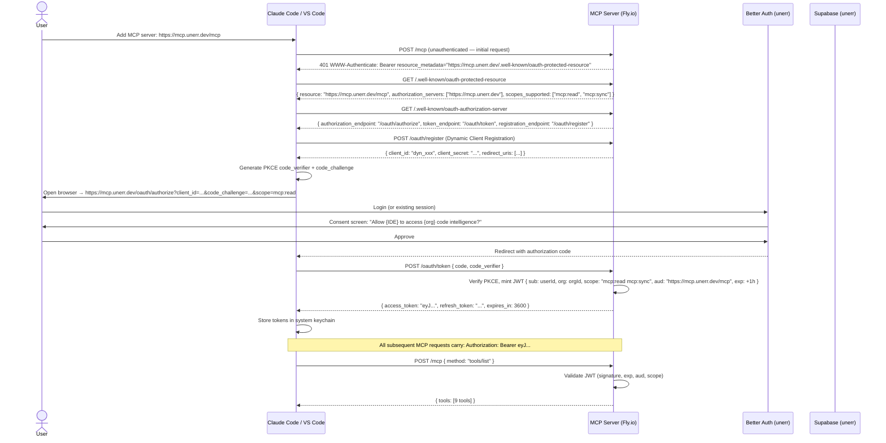
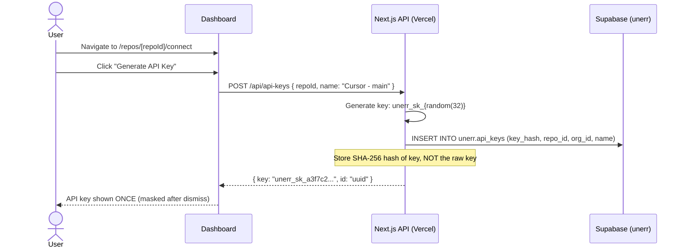
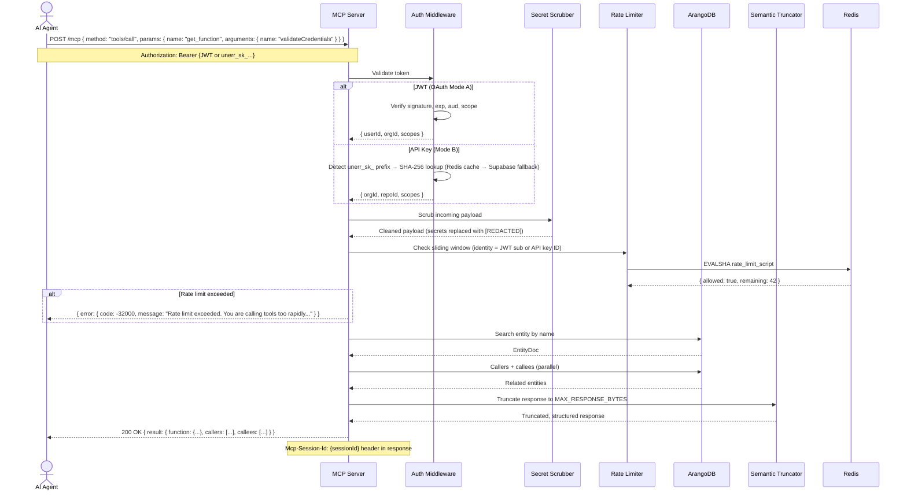
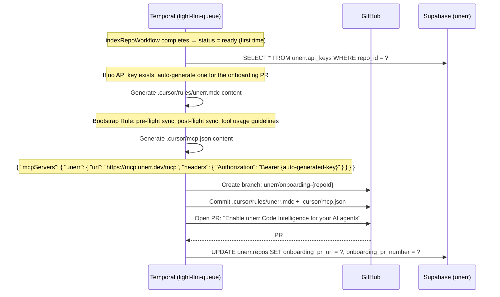
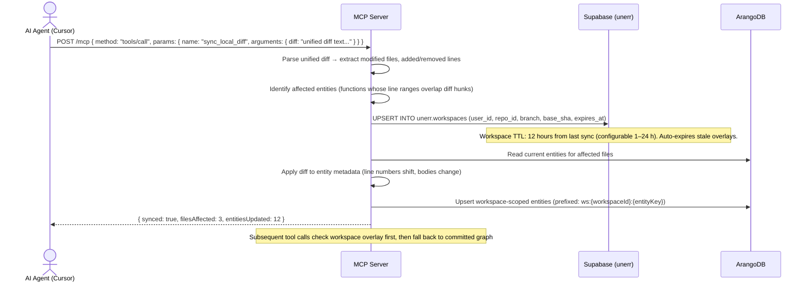

# Phase 2 — Hosted MCP Server: Deep Dive & Implementation Tracker

> **Phase Feature Statement:** _"I paste a unerr MCP URL into Cursor/Claude Code, and my AI agent can search my codebase and inspect functions."_
>
> **Source:** [`VERTICAL_SLICING_PLAN.md`](./VERTICAL_SLICING_PLAN.md) — Phase 2
>
> **Prerequisite:** [Phase 1 — GitHub Connect & Repository Indexing](./PHASE_1_GITHUB_CONNECT_AND_INDEXING.md) (complete)
>
> **Parallel:** Phase 2 and [Phase 3 — Semantic Search](./VERTICAL_SLICING_PLAN.md) run concurrently after Phase 1. Phase 2 delivers keyword search + graph traversal via MCP tools. Phase 3 adds embedding-based semantic search as additional MCP tools. Both feed into Phase 4.
>
> **Database convention:** All unerr Supabase tables use PostgreSQL schema `unerr`. See [VERTICAL_SLICING_PLAN.md § Storage & Infrastructure Split](./VERTICAL_SLICING_PLAN.md#storage--infrastructure-split).

---

## Table of Contents

- [Part 1: Architectural Deep Dive](#part-1-architectural-deep-dive)
  - [1.1 Core User Flows](#11-core-user-flows)
  - [1.2 System Logic & State Management](#12-system-logic--state-management)
  - [1.3 Reliability & Resilience](#13-reliability--resilience)
  - [1.4 Performance Considerations](#14-performance-considerations)
  - [1.5 Phase Bridge → Phase 3 & Phase 4](#15-phase-bridge--phase-3--phase-4)
- [Part 2: Implementation Status & Testing](#part-2-implementation-status--testing)
  - [2.1 Testing Strategy](#21-testing-strategy)
  - [2.2 File Index](#22-file-index)
  - [2.3 Enhancement: Hybrid Repo/Workspace UI Hierarchy](#23-enhancement-hybrid-repoworkspace-ui-hierarchy)

---

# Part 1: Architectural Deep Dive

## 1.1 Core User Flows

Phase 2 has five actor journeys. Two actors exist: the **human user** (configures MCP, manages API keys, authorizes via OAuth) and the **AI agent** (Cursor, Claude Code, or any MCP-compatible client that invokes tools autonomously).

### Flow 0: Authentication Model — Dual-Mode Auth

> **MCP Spec Reference:** The MCP specification (2025-03-26 revision) mandates OAuth 2.1 for remote HTTP servers. The old HTTP+SSE transport (2024-11-05) with API keys in URLs is **deprecated**. unerr implements **dual-mode auth**: spec-compliant OAuth 2.1 as primary, with API key Bearer fallback for client compatibility.

**Why dual-mode:**

| Client | OAuth 2.1 Support | API Key Fallback Needed? |
|--------|-------------------|--------------------------|
| **Claude Code** | Full — auto-DCR, token stored in system keychain | No, but supported for CI/bots |
| **Claude.ai (web)** | Required — DCR mandatory, no alternative | No |
| **Cursor** | Partial/buggy — known issues with DCR + PKCE ([#3734](https://github.com/cursor/cursor/issues/3734), [#3522](https://github.com/cursor/cursor/issues/3522)) | **Yes — primary connection path for Cursor** |
| **VS Code (Copilot)** | Yes | No, but supported |
| **CI/automation/bots** | No browser available | **Yes — only viable path** |

**The dual-mode detection logic:**

```
Incoming request: Authorization: Bearer {token}
  │
  ├── token starts with "unerr_sk_"?
  │     YES → Mode B (API Key): HMAC-SHA256 hash lookup in unerr.api_keys
  │     Resolves: orgId, repoId, scopes from API key record
  │
  └── NO → Mode A (OAuth JWT): validate HMAC-SHA256 JWT signature, check exp/aud/scope
           Resolves: userId, orgId, scopes from JWT claims
           User must have active org membership + repo access
```

> **Precondition for all Phase 2 flows:** The user must have at least one organization
> with indexed repos. Users without an organization cannot create API keys or initiate
> OAuth MCP connections. The dashboard gates these UI elements behind having an
> organization. This state resolves automatically when the user connects GitHub or
> starts without GitHub (Phase 0/1).

### Flow 1: OAuth 2.1 Connection (Mode A — Claude Code, VS Code)

**Actor:** User configuring Claude Code or VS Code
**Precondition:** User has a unerr account, at least one indexed repo
**Outcome:** IDE has a valid OAuth token, MCP tools available — no API key needed


```mermaid
sequenceDiagram
    actor User
    participant IDE as Claude Code / VS Code
    participant MCP as MCP Server (Fly.io)
    participant BetterAuth as Better Auth (unerr)
    participant Supabase as Supabase (unerr)

    User->>IDE: Add MCP server: https://mcp.unerr.dev/mcp
    IDE->>MCP: POST /mcp (unauthenticated — initial request)
    MCP-->>IDE: 401 WWW-Authenticate: Bearer resource_metadata="https://mcp.unerr.dev/.well-known/oauth-protected-resource"

    IDE->>MCP: GET /.well-known/oauth-protected-resource
    MCP-->>IDE: { resource: "https://mcp.unerr.dev/mcp", authorization_servers: ["https://mcp.unerr.dev"], scopes_supported: ["mcp:read", "mcp:sync"] }

    IDE->>MCP: GET /.well-known/oauth-authorization-server
    MCP-->>IDE: { authorization_endpoint: "/oauth/authorize", token_endpoint: "/oauth/token", registration_endpoint: "/oauth/register" }

    IDE->>MCP: POST /oauth/register (Dynamic Client Registration)
    MCP-->>IDE: { client_id: "dyn_xxx", client_secret: "...", redirect_uris: [...] }

    IDE->>IDE: Generate PKCE code_verifier + code_challenge
    IDE->>User: Open browser → https://mcp.unerr.dev/oauth/authorize?client_id=...&code_challenge=...&scope=mcp:read

    User->>BetterAuth: Login (or existing session)
    BetterAuth->>User: Consent screen: "Allow {IDE} to access {org} code intelligence?"
    User->>BetterAuth: Approve
    BetterAuth-->>IDE: Redirect with authorization code

    IDE->>MCP: POST /oauth/token { code, code_verifier }
    MCP->>MCP: Verify PKCE, mint JWT { sub: userId, org: orgId, scope: "mcp:read mcp:sync", aud: "https://mcp.unerr.dev/mcp", exp: +1h }
    MCP-->>IDE: { access_token: "eyJ...", refresh_token: "...", expires_in: 3600 }

    IDE->>IDE: Store tokens in system keychain

    Note over IDE,MCP: All subsequent MCP requests carry: Authorization: Bearer eyJ...
    IDE->>MCP: POST /mcp { method: "tools/list" }
    MCP->>MCP: Validate JWT (signature, exp, aud, scope)
    MCP-->>IDE: { tools: [9 tools] }
```

**Better Auth as the OAuth authorization server:**

unerr does NOT need a separate OAuth server. Better Auth already manages user identity, sessions, and org memberships. The MCP server extends it to act as an OAuth 2.1 authorization server:

| OAuth 2.1 Endpoint | Implementation |
|---------------------|---------------|
| `/.well-known/oauth-protected-resource` | Static JSON (RFC 9728 Protected Resource Metadata) |
| `/.well-known/oauth-authorization-server` | Static JSON (RFC 8414 Authorization Server Metadata) |
| `/oauth/register` | Dynamic Client Registration (RFC 7591) — stores client in Redis (TTL 24h) |
| `/oauth/authorize` | Redirects to unerr login page (Better Auth session). Shows consent screen. Returns auth code. |
| `/oauth/token` | Validates PKCE code_verifier, mints JWT with user/org/scope claims. Issues refresh token. |

**JWT claims:**

```
{
  "sub": "user-uuid",              // Better Auth user ID
  "org": "org-uuid",               // Active org (from session)
  "scope": "mcp:read mcp:sync",    // Consented scopes
  "aud": "https://mcp.unerr.dev/mcp",  // Resource indicator (RFC 8707)
  "exp": 1708300800,               // 1 hour from issuance
  "iat": 1708297200
}
```

The JWT is signed with `BETTER_AUTH_SECRET` (HMAC-SHA256). The MCP server validates it locally — no Supabase lookup on every request (unlike API key mode). Repo scoping is determined at query time: the user's org membership grants access to all repos in that org.

### Flow 2: API Key Connection (Mode B — Cursor, CI/Bots)

**Actor:** User configuring Cursor or a CI pipeline
**Precondition:** User has generated an API key in the dashboard
**Outcome:** MCP tools available via Bearer token header


```mermaid
sequenceDiagram
    actor User
    participant Dashboard
    participant NextAPI as Next.js API (Vercel)
    participant Supabase as Supabase (unerr)

    User->>Dashboard: Navigate to /repos/[repoId]/connect
    User->>Dashboard: Click "Generate API Key"
    Dashboard->>NextAPI: POST /api/api-keys { repoId, name: "Cursor - main" }
    NextAPI->>NextAPI: Generate key: unerr_sk_{random(32)}
    NextAPI->>Supabase: INSERT INTO unerr.api_keys (key_hash, repo_id, org_id, name)
    Note over NextAPI: Store SHA-256 hash of key, NOT the raw key
    NextAPI-->>Dashboard: { key: "unerr_sk_a3f7c2...", id: "uuid" }
    Dashboard-->>User: API key shown ONCE (masked after dismiss)
```

The user then configures their IDE:

**Cursor (`.cursor/mcp.json`):**
```json
{
  "mcpServers": {
    "unerr": {
      "url": "https://mcp.unerr.dev/mcp",
      "headers": {
        "Authorization": "Bearer unerr_sk_a3f7c2..."
      }
    }
  }
}
```

**Cursor workaround (if native header support is flaky):**
```json
{
  "mcpServers": {
    "unerr": {
      "command": "npx",
      "args": ["mcp-remote", "https://mcp.unerr.dev/mcp",
               "--header", "Authorization: Bearer unerr_sk_a3f7c2..."]
    }
  }
}
```

**Claude Code (CLI):**
```bash
claude mcp add --transport http unerr https://mcp.unerr.dev/mcp \
  --header "Authorization: Bearer unerr_sk_a3f7c2..."
```

**CI pipeline (`.mcp.json` in repo root):**
```json
{
  "mcpServers": {
    "unerr": {
      "type": "http",
      "url": "https://mcp.unerr.dev/mcp",
      "headers": {
        "Authorization": "Bearer ${UNERR_API_KEY}"
      }
    }
  }
}
```

**API Key critical decisions:**

| Decision | Choice | Rationale |
|----------|--------|-----------|
| Key format | `unerr_sk_{random(32)}` prefixed | Prefix enables GitHub secret scanning to auto-revoke leaked keys. `sk_` is a common convention (Stripe, OpenAI). |
| Storage | SHA-256 hash in DB, raw key shown once | Industry standard. If DB is compromised, hashed keys are useless. |
| Scope | Per-repo | Least privilege. A key for repo A cannot query repo B. Multi-repo keys are a Phase 5+ feature. |
| Rotation | Revoke + regenerate | No key rotation (swap). User revokes old key, generates new one. Simpler, fewer race conditions. |
| Rate limit identity | API key or JWT subject (not IP) | Per-identity rate limiting prevents one agent from starving others. |

---

### Flow 3: MCP Tool Invocation (Streamable HTTP Transport)

**Actor:** AI agent (autonomous tool invocation during a coding task)
**Precondition:** Authenticated via OAuth JWT or API key Bearer token
**Outcome:** Agent receives structured code intelligence data

**MCP transport model — Streamable HTTP (MCP spec 2025-03-26):**

```
┌───────────────────────────────────────────────────────────────┐
│        MCP Transport: Streamable HTTP (2025-03-26 spec)       │
│                                                               │
│  Client (Cursor/Claude Code)       Server (Fly.io)            │
│  ──────────────────────            ─────────────              │
│                                                               │
│  Single endpoint: https://mcp.unerr.dev/mcp                  │
│                                                               │
│  POST /mcp ─────────────────────► tool_call: search_code     │
│    Authorization: Bearer {token}   Response: application/json │
│    Accept: application/json,       OR text/event-stream (SSE) │
│            text/event-stream                                  │
│                          ◄──────── { result: {...} }          │
│                                                               │
│  POST /mcp ─────────────────────► tool_call: get_function    │
│                          ◄──────── { result: {...} }          │
│                                                               │
│  GET /mcp (optional) ───────────► SSE stream for server       │
│    Mcp-Session-Id: {id}           notifications               │
│                          ◄──────── event: notification        │
│                                                               │
│  Sessions managed via Mcp-Session-Id header                   │
└───────────────────────────────────────────────────────────────┘
```

**Key differences from the old HTTP+SSE transport (deprecated):**

| Aspect | Old (2024-11-05) | New Streamable HTTP (2025-03-26) |
|--------|-------------------|----------------------------------|
| Endpoint | Two endpoints: `/sse` + `/message` | **Single endpoint: `/mcp`** |
| Auth | API key in URL path | **`Authorization: Bearer` header** |
| Tool calls | POST to `/message`, result via SSE | **POST to `/mcp`, response in same HTTP response** (JSON or SSE) |
| Sessions | SSE connection = session | **`Mcp-Session-Id` header**, persistent across requests |
| Server notifications | SSE stream required | **Optional `GET /mcp`** for SSE stream |
| Connection lifetime | Long-lived SSE mandatory | **Stateless HTTP requests** (SSE optional) |

**Why Streamable HTTP changes the Vercel constraint:** With the new transport, each tool call is an independent HTTP POST that returns in milliseconds — no long-lived SSE connection required. The optional SSE stream for server-initiated notifications (e.g., workspace sync events) still needs a long-running process, but the **core tool invocation path is now compatible with serverless**. However, the OAuth endpoints, session management, and optional SSE still benefit from a dedicated container. The Phase 2 architecture retains the Fly.io deployment for robustness, with a future option to move tool-call-only traffic to Vercel Edge Functions.


```mermaid
sequenceDiagram
    actor Agent as AI Agent
    participant MCP as MCP Server
    participant Auth as Auth Middleware
    participant Scrubber as Secret Scrubber
    participant RateLimit as Rate Limiter
    participant ArangoDB
    participant Formatter as Semantic Truncator

    Agent->>MCP: POST /mcp { method: "tools/call", params: { name: "get_function", arguments: { name: "validateCredentials" } } }
    Note over Agent,MCP: Authorization: Bearer {JWT or unerr_sk_...}

    MCP->>Auth: Validate token
    alt JWT (OAuth Mode A)
        Auth->>Auth: Verify signature, exp, aud, scope
        Auth-->>MCP: { userId, orgId, scopes }
    else API Key (Mode B)
        Auth->>Auth: Detect unerr_sk_ prefix → SHA-256 lookup (Redis cache → Supabase fallback)
        Auth-->>MCP: { orgId, repoId, scopes }
    end

    MCP->>Scrubber: Scrub incoming payload
    Scrubber-->>MCP: Cleaned payload (secrets replaced with [REDACTED])

    MCP->>RateLimit: Check sliding window (identity = JWT sub or API key ID)
    RateLimit->>Redis: EVALSHA rate_limit_script
    Redis-->>RateLimit: { allowed: true, remaining: 42 }

    alt Rate limit exceeded
        MCP-->>Agent: { error: { code: -32000, message: "Rate limit exceeded. You are calling tools too rapidly..." } }
    end

    MCP->>ArangoDB: Search entity by name
    ArangoDB-->>MCP: EntityDoc
    MCP->>ArangoDB: Callers + callees (parallel)
    ArangoDB-->>MCP: Related entities

    MCP->>Formatter: Truncate response to MAX_RESPONSE_BYTES
    Formatter-->>MCP: Truncated, structured response

    MCP-->>Agent: 200 OK { result: { function: {...}, callers: [...], callees: [...] } }
    Note over MCP: Mcp-Session-Id: {sessionId} header in response
```

**The three security layers every MCP request passes through:**

| Layer | Purpose | Failure mode |
|-------|---------|-------------|
| **Edge Secret Scrubber** | Prevent agents from leaking secrets found in source code back to the LLM provider. Catches: AWS keys, GitHub tokens, JWTs, high-entropy strings. | If a secret is missed: LLM provider sees it (data leak). False positive: benign string redacted (minor UX issue). Conservative approach: over-scrub. |
| **Rate Limiter** | Prevent runaway agent loops from exhausting ArangoDB connections and running up costs. 60 tool calls per 60-second sliding window per identity. | At 429: agent receives structured JSON-RPC error in response body. Smart agents (Claude, GPT-4) read this and self-correct. Dumb agents may keep retrying — the rate limit caps damage. |
| **Semantic Truncator** | Prevent MCP responses from exceeding LLM context windows. Truncates large function bodies, long caller/callee lists. Respects function boundaries (never cuts mid-statement). | Over-truncation: agent gets partial info but can call `get_function` again with depth parameter. Under-truncation: token budget exceeded in LLM — the LLM's own context window management handles this. |

**Why this cannot fully run on Vercel (yet):** While tool calls are now stateless HTTP POSTs (serverless-compatible), the OAuth endpoints (`/oauth/authorize`, `/oauth/token`, `/oauth/register`), session management via `Mcp-Session-Id`, and the optional SSE stream for server notifications still benefit from a persistent process. Phase 2 deploys the MCP server on Fly.io. A future optimization could split: tool calls on Vercel Edge, OAuth + SSE on Fly.io.

---

---

### Flow 4: Auto-PR IDE Bootstrap (Bootstrap Rule Distribution)

**Actor:** System (triggered after first successful indexing of a repo)
**Precondition:** Repo status transitions to `ready` for the first time, org has GitHub App installation
**Outcome:** PR opened on GitHub with `.cursor/rules/unerr.mdc` and `.cursor/mcp.json`


```mermaid
sequenceDiagram
    participant Temporal as Temporal (light-llm-queue)
    participant GitHub
    participant Supabase as Supabase (unerr)

    Note over Temporal: indexRepoWorkflow completes → status = ready (first time)

    Temporal->>Supabase: SELECT * FROM unerr.api_keys WHERE repo_id = ?
    Note over Temporal: If no API key exists, auto-generate one for the onboarding PR

    Temporal->>Temporal: Generate .cursor/rules/unerr.mdc content
    Note over Temporal: Bootstrap Rule: pre-flight sync, post-flight sync, tool usage guidelines

    Temporal->>Temporal: Generate .cursor/mcp.json content
    Note over Temporal: { "mcpServers": { "unerr": { "url": "https://mcp.unerr.dev/mcp", "headers": { "Authorization": "Bearer {auto-generated-key}" } } } }

    Temporal->>GitHub: Create branch: unerr/onboarding-{repoId}
    Temporal->>GitHub: Commit .cursor/rules/unerr.mdc + .cursor/mcp.json
    Temporal->>GitHub: Open PR: "Enable unerr Code Intelligence for your AI agents"
    GitHub-->>Temporal: PR #N created

    Temporal->>Supabase: UPDATE unerr.repos SET onboarding_pr_url = ?, onboarding_pr_number = ?
```

**The Bootstrap Rule (`unerr.mdc`) — what it tells AI agents:**

```markdown
---
description: unerr integration rules — always active
globs: ["**/*"]
alwaysApply: true
unerr_rule_version: "1.0.0"
---

RULE: Before starting any coding task, call sync_local_diff to upload
uncommitted changes to unerr's cloud graph. This ensures search results
reflect your current working state, not just the last commit.

IMPORTANT: When generating the diff for sync_local_diff, EXCLUDE lockfiles
and build artifacts. Use a filtered diff command:
  git diff HEAD -- . ':!package-lock.json' ':!pnpm-lock.yaml' ':!yarn.lock'
    ':!Gemfile.lock' ':!poetry.lock' ':!Cargo.lock' ':!go.sum'
    ':!composer.lock' ':!node_modules/' ':!dist/' ':!.next/' ':!build/'
This prevents the 50 KB diff limit from being consumed by lockfile noise.

RULE: After completing a significant change, call sync_local_diff again
so unerr can update the cloud graph with your modifications.

RULE: When asked about code structure, use get_function, get_class,
get_callers, and get_callees to understand relationships before modifying code.

RULE: When searching for code, use search_code with descriptive terms.
If initial results are insufficient, try alternative keywords or use
get_imports to trace module dependencies.

RULE: Always format file paths relative to the ROOT of the git repository
when calling unerr MCP tools, regardless of your current working directory.
For example, if the repo root is /project and you are working inside
/project/packages/frontend, refer to files as "packages/frontend/src/auth.ts"
not "src/auth.ts". Run `git rev-parse --show-toplevel` to find the repo root
if unsure.
```

**Rule versioning:** The `unerr_rule_version` field in the frontmatter enables automated rule updates. When unerr ships a new Bootstrap Rule version (e.g., adding Phase 3 semantic search tools), the Auto-PR workflow compares the installed version against the latest. If outdated, it opens a PR titled "Update unerr Bootstrap Rule (v1.0.0 → v1.1.0)" with a changelog in the PR body. This ensures teams always have the latest agent instructions without manual intervention. The version follows semver: patch = wording tweaks, minor = new rules/tools, major = breaking changes to agent workflow.

**Why Auto-PR instead of dashboard instructions:**

| Approach | Pros | Cons |
|----------|------|------|
| Dashboard instructions (manual) | User controls when to adopt | Friction — user must copy files manually, easy to skip |
| **Auto-PR (Phase 2)** | **One-click merge enables whole team. Reviewed in standard PR workflow.** | PR noise. User must merge. |
| Direct commit to default branch | Zero friction | Dangerous — bypasses review. Branch protection blocks this. |

---

### Flow 5: `sync_local_diff` — Shadow Workspace

**Actor:** AI agent (invokes `sync_local_diff` tool as instructed by Bootstrap Rule)
**Precondition:** Agent has MCP connection, user has uncommitted changes locally
**Outcome:** Cloud graph updated with a workspace overlay reflecting local changes


```mermaid
sequenceDiagram
    actor Agent as AI Agent (Cursor)
    participant MCP as MCP Server
    participant Supabase as Supabase (unerr)
    participant ArangoDB

    Agent->>MCP: POST /mcp { method: "tools/call", params: { name: "sync_local_diff", arguments: { diff: "unified diff text..." } } }

    MCP->>MCP: Parse unified diff → extract modified files, added/removed lines
    MCP->>MCP: Identify affected entities (functions whose line ranges overlap diff hunks)

    MCP->>Supabase: UPSERT INTO unerr.workspaces (user_id, repo_id, branch, base_sha, expires_at)
    Note over Supabase: Workspace TTL: 12 hours from last sync (configurable 1–24 h). Auto-expires stale overlays.

    MCP->>ArangoDB: Read current entities for affected files
    MCP->>MCP: Apply diff to entity metadata (line numbers shift, bodies change)
    MCP->>ArangoDB: Upsert workspace-scoped entities (prefixed: ws:{workspaceId}:{entityKey})

    MCP-->>Agent: { synced: true, filesAffected: 3, entitiesUpdated: 12 }

    Note over MCP: Subsequent tool calls check workspace overlay first, then fall back to committed graph
```

**Workspace overlay read path:**

When an MCP tool (e.g., `get_function`) executes, the query path is:

```
1. Check if active workspace exists for (userId, repoId, branch)
2. If workspace exists and not expired:
   a. Query workspace-scoped entities first (ws:{workspaceId}:*)
   b. Merge with committed entities (committed graph)
   c. Workspace entities override committed entities by _key match
3. If no workspace: query committed graph directly (Phase 1 behavior)
```

> **Phase 5.5 CLI repos note:** For repos ingested via `unerr push` (provider: `local_cli`), the uploaded + indexed snapshot serves as the "base commit" equivalent. The `sync_local_diff` overlay works identically — workspace-scoped entities override the committed graph. The `baseSha` field is set to a hash of the upload timestamp (e.g., `cli:{timestamp}`) since there is no git SHA for local repos. `unerr watch` streams diffs against this baseline, and `unerr push` resets it.

**Critical constraint — workspace TTL:**

Workspaces expire **12 hours** after last `sync_local_diff` call (configurable per-org, range 1–24 h, default 12 h). The extended TTL ensures workspaces survive overnight coding sessions and timezone gaps without unexpected staleness, while still being short enough to prevent unbounded overlay growth. On first `sync_local_diff` after expiry ("cold start"), the tool detects that `expires_at < NOW()`, purges the stale overlay from ArangoDB, and performs a full workspace rebuild from the latest indexed commit — the developer sees no error, only a slightly longer first-sync latency (~1–2 s instead of ~300 ms).

The TTL is enforced via:
- Supabase `expires_at` column — checked on every workspace resolution. Updated (sliding window) on each `sync_local_diff` call.
- ArangoDB: workspace-scoped entities carry `expires_at` field — a periodic cleanup job (Temporal cron, every 15 min) removes expired workspace entities
- **Cold-start path:** If `expires_at < NOW()` at sync time → delete all overlay entities for workspace → re-create workspace with fresh `baseSha` → apply incoming diff → set new `expires_at` = NOW + 12 h

---

## 1.2 System Logic & State Management

### Deployment Topology — The Two-Process Architecture

Phase 2 introduces a split deployment. The Next.js dashboard and the MCP server are separate processes:

```
┌──────────────────────────────────┐    ┌──────────────────────────────────┐
│         Vercel (Dashboard)        │    │       Fly.io (MCP Server)         │
│                                   │    │                                   │
│  Next.js SSR/SSG                 │    │  Node.js HTTP + Streamable HTTP  │
│  /dashboard/*                     │    │  /mcp (single MCP endpoint)      │
│  /api/repos/*                     │    │  /oauth/* (OAuth 2.1 endpoints)  │
│  /api/api-keys/*                  │    │  /.well-known/* (discovery)      │
│  /api/webhooks/*                  │    │                                   │
│  /api/github/*                    │    │  Stateless HTTP (SSE optional)   │
│                                   │    │  Auto-scaling (suspend/resume)   │
│  Serverless (10s–60s timeout)    │    │  512 MB per instance, port 8787   │
└──────────────┬───────────────────┘    └──────────────┬───────────────────┘
               │                                        │
               │         Shared Infrastructure          │
               │                                        │
          ┌────▼────────────────────────────────────────▼────┐
          │                                                    │
          │  Supabase (PostgreSQL) ── Auth + Repos + API Keys  │
          │  ArangoDB ── Code Intelligence Graph                │
          │  Redis ── Rate Limiting + Caching + Sessions        │
          │  Temporal ── Background Workflows                    │
          │                                                    │
          └────────────────────────────────────────────────────┘
```

**Why split deployment:**

| Concern | Dashboard (Vercel) | MCP Server (Fly.io) |
|---------|-------------------|---------------------|
| Connection lifetime | Request-response (ms) | Stateless HTTP + optional SSE for notifications |
| Scaling model | Serverless (per-request) | Container (OAuth state + session management) |
| Cold start tolerance | Yes (Vercel handles) | Low tolerance (OAuth flows need fast response) |
| Cost model | Per-invocation | Per-container-hour |
| Region affinity | Edge (global CDN) | Single region (close to ArangoDB/Supabase) |
| Auth responsibility | Better Auth sessions (cookies) | OAuth 2.1 + API key Bearer validation |

**Shared infrastructure access:** Both processes connect to the same Supabase, ArangoDB, Redis, and Temporal instances. The DI container (`getContainer()`) works identically in both processes. The MCP server uses the same `lib/ports/*` and `lib/adapters/*` as the dashboard — no code duplication.

### API Key Lifecycle

```
┌──────────┐     POST /api/api-keys      ┌──────────┐
│  (none)  │ ──────────────────────────► │  active   │
└──────────┘                              └──────────┘
                                               │
                                  DELETE /api/api-keys/:id
                                               │
                                               ▼
                                          ┌──────────┐
                                          │ revoked   │
                                          └──────────┘
                                               │
                                     30-day retention
                                               │
                                               ▼
                                          [hard delete]
```

**Key storage schema (Supabase `unerr.api_keys`):**

```
key_hash        VARCHAR    HMAC-SHA256 of raw key (lookup index)
key_prefix      VARCHAR    "unerr_sk_{first 4 random chars}****" (display only)
org_id          VARCHAR    FK → organization
repo_id         VARCHAR    FK → repo (nullable for future org-wide keys)
name            VARCHAR    User-provided label ("Cursor - main branch")
is_default      BOOLEAN    Auto-generated key for onboarding PR (default false)
scopes          TEXT[]     ["mcp:read"] (read-only) | ["mcp:read", "mcp:sync"] (includes sync_local_diff)
last_used_at    TIMESTAMP  Updated on every MCP request (async, non-blocking)
revoked_at      TIMESTAMP  NULL = active, non-NULL = revoked
created_at      TIMESTAMP
```

> **Note on hashing:** Keys are hashed using HMAC-SHA256 with a fixed server-side salt (`unerr-api-key-salt`), not plain SHA-256. This prevents preimage attacks even if the salt is leaked without the key material.

**Lookup path (on every MCP request — Mode B only):** API key is in the `Authorization: Bearer` header. Server detects `unerr_sk_` prefix, computes HMAC-SHA256, queries `unerr.api_keys WHERE key_hash = ? AND revoked_at IS NULL`. This lookup is cached in Redis (`mcp:apikey:{hash}`, TTL 5 min) to avoid hitting Supabase on every tool call. For OAuth Mode A, the JWT is validated locally (signature + expiry) with no database lookup.

### MCP Session State

Sessions are managed via the `Mcp-Session-Id` header (MCP spec 2025-03-26). The server generates a session ID on the first authenticated request and returns it in the response header. The client includes this header in all subsequent requests.

```
Redis key: mcp:session:{sessionId}
TTL: 1 hour from last request (fixed — not configurable per session)
Value: {
  authMode: "oauth" | "api_key",
  orgId: "uuid",
  repoId: "uuid|null",      // null for OAuth (org-scoped), set for API key (repo-scoped)
  userId: "uuid",
  createdAt: ISO-8601,
  lastToolCallAt: ISO-8601
}
```

> **Note:** The session record omits `authMode`-specific fields like `identityId` and `toolCallCount` compared to the original spec — the production implementation stores a minimal set for re-auth context.

**Session persistence via Redis:** Session state is stored in Redis (key `unerr:mcp:session:{sessionId}`) with a sliding TTL. Because Redis is external to the MCP server container, sessions survive zero-downtime deployments (blue/green, rolling restart). When a new container starts, it reads the existing session from Redis — no re-authentication required. Fly.io rolling deploys drain in-flight requests to the old container while the new container picks up new requests with full session context.

**Failure mode:** If Redis is unavailable during a deployment, the `Mcp-Session-Id` becomes invalid. The client detects this (server returns HTTP 400 with `session_not_found` error per MCP spec) and initiates a new session. Workspace overlays survive regardless (they're in Supabase + ArangoDB, not Redis). OAuth tokens survive (stored client-side in system keychain). API keys survive (static). The only cost of a Redis outage during deploy is a single re-authentication round-trip (~500 ms).

### MCP Tool Registry

The MCP server exposes tools across **Phases 2–8**. All tools are discovered by agents via `tools/list`. Phase 2 tools are the foundational set; subsequent phases add tools without breaking backward compatibility.

**Phase 2 — Core code intelligence (keyword + graph):**

| Tool | Input Schema | Output Shape | ArangoDB Queries | Estimated Latency |
|------|-------------|-------------|-----------------|-------------------|
| `search_code` | `{ query: string, limit?: number }` | `{ results: [{ name, kind, file, line, signature, score }] }` | Fulltext search on entity names + signatures | < 200ms |
| `get_function` | `{ name: string } \| { file: string, line: number }` | `{ function: EntityDoc, callers: EntityDoc[], callees: EntityDoc[] }` | Entity lookup + 1-hop `calls` traversal | < 300ms |
| `get_class` | `{ name: string }` | `{ class: EntityDoc, methods: EntityDoc[], extends: EntityDoc[], implements: EntityDoc[] }` | Entity lookup + `extends`/`implements` traversal | < 300ms |
| `get_file` | `{ path: string }` | `{ file: FileDoc, entities: EntityDoc[] }` | `getEntitiesByFile()` | < 200ms |
| `file_context` | `{ path: string }` | File-level context summary with entity list | `getEntitiesByFile()` | < 200ms |
| `get_callers` | `{ name: string, depth?: number }` | `{ entity: EntityDoc, callers: EntityDoc[] }` | N-hop INBOUND on `calls` (max depth: 5) | < 500ms (depth 5) |
| `get_callees` | `{ name: string, depth?: number }` | `{ entity: EntityDoc, callees: EntityDoc[] }` | N-hop OUTBOUND on `calls` (max depth: 5) | < 500ms |
| `get_imports` | `{ file: string, depth?: number }` | `{ file: string, imports: [{ path, entities }] }` | N-hop OUTBOUND on `imports` | < 500ms |
| `get_project_stats` | `{}` | `{ files, functions, classes, interfaces, languages: {} }` | Aggregation across collections | < 300ms |
| `sync_local_diff` | `{ diff: string, branch?, prompt?, agent_model?, agent_tool?, mcp_tools_called?, validation_result? }` | `{ synced: boolean, filesAffected, entitiesUpdated, ledgerEntryId? }` | Read + workspace overlay write + optional ledger append | < 1s |

**Phase 3–8 tools** are also registered in the same server (see [Phase 3](./PHASE_3_SEMANTIC_SEARCH.md) onward for full specs): `semantic_search`, `find_similar` (Phase 3); `get_business_context`, `search_by_purpose`, `analyze_impact`, `get_blueprint` (Phase 4); `get_recent_changes` (Phase 5); `get_timeline`, `mark_working`, `revert_to_working_state`, `sync_dirty_buffer` (Phase 5.5); `get_rules`, `check_rules`, `check_patterns`, `get_conventions`, `suggest_approach`, `get_relevant_rules`, `draft_architecture_rule` (Phase 6); `review_pr_status` (Phase 7); `assemble_context`, `refresh_context` (Phase 8).

---

## 1.3 Reliability & Resilience

### Failure Scenario Matrix

| # | Failure Scenario | Probability | Impact | Detection | Recovery Strategy |
|---|-----------------|-------------|--------|-----------|-------------------|
| 1 | **MCP server container crash** | Low | In-flight HTTP requests fail. Optional SSE notification streams drop. Agents lose tool access temporarily. | Fly.io health check fails → auto-restart. | Fly.io auto-restarts container (< 5s). Clients retry failed HTTP requests automatically. **Sessions survive** — `Mcp-Session-Id` is stored in Redis, so the new container reads existing session state. No re-authentication needed unless Redis is also down (unlikely). OAuth tokens survive (stored client-side in keychain). API keys unaffected (static). Workspace overlays survive (Supabase + ArangoDB). |
| 2 | **ArangoDB timeout during tool call** | Medium | Single tool call fails. Agent gets error response. | Activity timeout (2s per ArangoDB query). | Return structured error in MCP tool result: `"Database temporarily unavailable. Retry in a few seconds."` Agent can retry. Circuit breaker after 5 consecutive failures → tool returns cached/stale result or graceful error. |
| 3 | **Runaway agent loop** (60+ calls/min) | Medium–High | ArangoDB connection pool exhausted, other agents starved. | Rate limiter triggers at 60 calls/60s window. | 429 returned in tool result body with self-correction message. Agent reads it and pauses. If agent ignores: rate limit caps damage. No cascading failure — rate limit is per identity (JWT sub or API key ID). |
| 4 | **Network flap during tool call** | Medium | Individual HTTP request fails. Agent does not get tool result. | HTTP timeout or connection reset. | Streamable HTTP is stateless — client simply retries the POST. No session reconstruction needed. `Mcp-Session-Id` persists across retries. Workspace overlay preserved. |
| 5 | **API key leaked** (committed to public repo) | Low–Medium | Unauthorized access to org's code intelligence data. | GitHub secret scanning detects `unerr_sk_` prefix. `/api/api-keys/[id]/rotate` endpoint. | Auto-revoke via GitHub webhook (`secret_scanning_alert`). Notify org admin via email. Key hash invalidated in Redis immediately. Audit log created. |
| 6 | **Secret found in MCP response** (scrubber miss) | Low | Secret sent to LLM provider via agent context. | Post-hoc audit: log all MCP responses (hashed), periodic grep for known patterns. | Immediate scrubber rule update. Incident response: rotate the leaked secret. Improve scrubber regex/entropy thresholds. |
| 7 | **Auto-PR creation fails** (branch protection, no write access) | Medium | Onboarding PR not created. User must manually configure MCP. | Temporal activity failure logged. Repo dashboard shows "Manual setup required". | Fallback: dashboard shows manual copy-paste instructions. Retry Auto-PR on next indexing completion. Log failure reason for debugging. |
| 8 | **Redis down** (rate limiter unavailable) | Low | Rate limiting disabled (fail-open). Secret scrubber still works (stateless). Session state lost. | Health check reports Redis down. | **Fail-open on rate limiting** — allow requests but log warning. This is safe because ArangoDB's own connection pool limits act as a secondary circuit breaker. API key lookup falls back to Supabase (slower). |
| 9 | **Stale workspace overlay** (user forgot to re-sync) | High | Agent searches return outdated results that don't match local files. | No automated detection — relies on Bootstrap Rule compliance. | Workspace TTL (12 hours, configurable 1–24 h) limits staleness. Cold-start logic on next `sync_local_diff` purges stale overlay and rebuilds from latest commit. Dashboard shows workspace last-sync timestamp. Bootstrap Rule instructs agent to sync before and after each task. |
| 10 | **Concurrent tool calls from same agent** | Medium | Multiple ArangoDB queries in flight from parallel HTTP requests. No data corruption risk (read-only). | Connection pool metrics. | ArangoDB connection pool (10 connections per container) handles parallel requests. If pool exhausted: request queues briefly (< 100ms). No data integrity concern for read-only tools. Rate limiter counts all calls regardless of concurrency. |
| 11 | **OAuth token expiry during agent session** | Medium | Tool call returns 401. Agent cannot refresh without user interaction. | JWT `exp` check on every request. | MCP spec supports token refresh: client uses refresh token to get new access token (no browser needed). If refresh token also expired: client prompts user to re-authorize (opens browser). Session preserved via `Mcp-Session-Id`. |
| 12 | **Concurrent `sync_local_diff` calls** (same workspace) | Medium | Without locking, parallel writes to ArangoDB overlay produce inconsistent entity state (partial updates, duplicate keys). | Redis distributed lock on `unerr:lock:workspace:{userId}:{repoId}:{branch}`. | Lock acquired before sync execution (TTL 30 s, 3 retries, 200 ms backoff). If lock unavailable: tool returns structured error asking agent to retry. Lock released in `finally` block. No data corruption possible — lock serializes all writes to the same workspace. |

### Circuit Breaker Patterns

**ArangoDB connection circuit breaker (in-process per container):**

Each MCP server container maintains a lightweight in-process state machine to prevent ArangoDB connection pool exhaustion from cascading into full container failure:

```
State: CLOSED (normal operation)
  │
  │  5 consecutive failures (timeout or error)
  │
  ▼
State: OPEN (reject all ArangoDB queries for 30s)
  │  Return cached results if available, else structured error
  │
  │  After 30s cooldown
  │
  ▼
State: HALF-OPEN (allow 1 probe query)
  │
  ├── Probe succeeds → CLOSED
  └── Probe fails → OPEN (reset 30s timer)
```

This is a simple in-process state machine (no shared Redis state). Each Fly.io container has its own breaker — there is no global circuit-open state.

**Ledger circuit breaker (`lib/mcp/security/circuit-breaker.ts`) — Phase 5.5:**

A separate circuit breaker halts entity sync from `sync_local_diff` when it detects an AI hallucination loop (the same entity being modified repeatedly within a short window). This uses Redis atomic counters:

```
Redis key: unerr:circuit:{orgId}:{repoId}:{entityKey}   ← sliding counter (TTL: window)
Redis key: unerr:circuit:tripped:{orgId}:{repoId}:{entityKey}  ← cooldown flag (TTL: cooldown)

Defaults: threshold=4 edits in 10 min → 5 min cooldown
Config:   CIRCUIT_BREAKER_THRESHOLD, CIRCUIT_BREAKER_WINDOW_MINUTES,
          CIRCUIT_BREAKER_COOLDOWN_MINUTES, CIRCUIT_BREAKER_ENABLED
```

When tripped, `sync_local_diff` skips overlay writes for the flagged entity and returns a structured message instructing the agent to pause and review.

---

## 1.4 Performance Considerations

### Critical Path Latency Targets

| # | Path | Target (p95) | Breakdown | Bottleneck | Mitigation |
|---|------|-------------|-----------|------------|------------|
| 1 | **Initial auth + session creation** | < 500ms | Token validation (~5ms JWT local / ~50ms API key cached / ~200ms API key cold) + session creation (~10ms Redis) + `tools/list` response (~5ms) | First request after API key cache expires (Mode B). OAuth JWT validated locally (Mode A — always fast). | Cache API key lookup in Redis (TTL 5 min). JWT signature verification is CPU-only (~2ms). Warm connection pool on container start. |
| 2 | **`search_code` tool call** | < 200ms | Scrub (~1ms) + rate check (~5ms Redis) + ArangoDB fulltext (~100ms) + truncation (~5ms) + response write (~5ms) | ArangoDB fulltext index performance on large repos (100k+ entities). | Fulltext index on `functions.name` + `functions.signature`. Limit results to top 20. |
| 3 | **`get_function` tool call** | < 300ms | Entity lookup (~50ms) + callers query (~80ms) + callees query (~80ms) + truncation (~10ms) | Three sequential ArangoDB queries. | Run callers + callees queries in parallel. Entity lookup is a direct `_key` access (O(1)). |
| 4 | **`get_callers`/`get_callees` (depth 5)** | < 500ms | N-hop graph traversal (~400ms for large graphs) | Explosion of results at depth 5 (callers of callers of callers...). | Hard cap: 500 results per traversal (already in `ArangoGraphStore`). Depth max: 5. Semantic truncation drops least-relevant results. |
| 5 | **`sync_local_diff`** | < 1s (warm) / < 2s (cold start) | Lock acquire (~5ms Redis) + lockfile stripping (~2ms) + diff parsing (~50ms) + entity lookup (~100ms) + workspace upsert (~200ms Supabase) + ArangoDB overlay write (~300ms). Cold start adds: stale overlay purge (~300ms) + baseSha reset (~100ms). | Large diffs (1000+ line changes across 20+ files). | Lockfile hunks stripped before size check (package-lock.json, pnpm-lock.yaml, etc.). Limit code diff size to 50KB after stripping. Redis distributed lock prevents concurrent writes to same workspace. |
| 6 | **`get_project_stats`** | < 300ms | Aggregation across 5 entity collections (COUNT per collection per repo). | Full collection scans without index. | Precalculated: entity counts stored in `unerr.repos` table (updated during indexing). ArangoDB query only for language breakdown. |
| 7 | **Auto-PR creation** | < 10s | Branch creation (~2s) + file commits (~2s) + PR creation (~2s) + Supabase update (~100ms) | GitHub API latency (3 sequential API calls). | Run as Temporal activity on `light-llm-queue` — not in the critical user path. Dashboard shows "Onboarding PR being created..." until complete. |

### Connection Pool Sizing (Phase 2 additions)

| System | Phase 1 Size | Phase 2 Size | Rationale |
|--------|-------------|-------------|-----------|
| ArangoDB (MCP server) | N/A (didn't exist) | **10 connections per container** | Each MCP tool call runs 1–3 ArangoDB queries. With 60 calls/min rate limit and ~300ms avg query time, 10 connections handle ~200 concurrent queries. |
| Redis (MCP server) | N/A | **5 connections per container** | Rate limit checks + session reads + API key cache. All sub-millisecond operations. |
| Supabase (MCP server) | N/A | **3 connections per container** | Only for API key validation cache miss and workspace upserts. Most reads hit Redis cache. |

### Memory Budget (MCP Server Container — 512 MB)

| Component | Memory | Rationale |
|-----------|--------|-----------|
| Node.js baseline | 50 MB | Node.js HTTP + custom streamable transport |
| Session state (per active session) | ~2 KB | Mcp-Session-Id, auth context, rate limit counters |
| ArangoDB connection pool | 10 MB | 10 connections × ~1 MB TCP buffer each |
| Redis connection | 2 MB | Single multiplexed connection |
| Secret scrubber regex cache | 5 MB | Compiled regex patterns, entropy lookup tables |
| Headroom | 189 MB | GC overhead, spike handling |
| OAuth endpoint overhead | 5 MB | DCR client cache, PKCE code verifier store, JWT signing |
| **Total per container** | **~70 MB baseline** | Fits well within 512 MB Fly.io container budget |

---

## 1.5 Phase Bridge → Phase 3 & Phase 4

Phase 3 (Semantic Search) and Phase 4 (Business Justification) build directly on Phase 2's MCP infrastructure.

### What Phase 2 Builds That Phase 3 Inherits

| Phase 2 Artifact | Phase 3 Usage |
|------------------|--------------|
| MCP server + transport layer | Phase 3 adds 2 new tools: `semantic_search`, `find_similar`. Same server, same transport, same security layers. |
| Tool registry (`lib/mcp/tools/index.ts`) | Phase 3 registers new tools in the same registry. No server-side changes needed. |
| Secret scrubber | Applied to all tools including new semantic search results. |
| Rate limiter | Same 60 calls/min limit covers new tools. |
| Semantic truncation (`formatter.ts`) | Embedding search results go through the same truncation pipeline. |
| Auth system (OAuth + API keys) | Same OAuth tokens and API keys grant access to new tools (backward-compatible scope expansion). |
| Dashboard "Connect IDE" page | Phase 3 adds search demo/playground widget on the same page. |
| Workspace overlay system | Semantic search respects workspace overlays — search results include uncommitted changes. |

### What Phase 2 Builds That Phase 4 Inherits

| Phase 2 Artifact | Phase 4 Usage |
|------------------|--------------|
| MCP tool infrastructure | Phase 4 adds `explain_function`, `justify_change`, `impact_analysis` tools. |
| `get_function` / `get_callers` / `get_callees` data | Phase 4's LLM prompts assemble context from these same graph traversals. |
| Workspace overlay | Phase 4 justification runs on the user's current working state, not just committed code. |
| Auto-PR system | Phase 4 extends Auto-PR to include justification reports in PR descriptions. |

### Seam Points Left for Phase 3

```
Seam 1: Embedding pipeline trigger
  Phase 2: indexRepoWorkflow ends at status "ready" (ArangoDB populated, no embeddings)
  Phase 3: After "ready", trigger embedRepoWorkflow → ILLMProvider.embed() → IVectorSearch.upsert()
           Repo status: ready → embedding → embedded

Seam 2: search_code tool — keyword only
  Phase 2: ArangoDB fulltext search on entity names + signatures
  Phase 3: Hybrid search = keyword (ArangoDB) + semantic (PGVectorStore) + reciprocal rank fusion

Seam 3: MCP tool set expansion
  Phase 2: 10 core tools (search_code, get_function, get_class, get_file, file_context,
           get_callers, get_callees, get_imports, get_project_stats, sync_local_diff)
  Phase 3: +2 tools (semantic_search, find_similar)
  Phase 4: +4 tools (get_business_context, search_by_purpose, analyze_impact, get_blueprint)

Seam 4: ILLMProvider activation
  Phase 2: ILLMProvider still a stub (not needed for keyword search + graph traversal)
  Phase 3: ILLMProvider.embed() activated (HuggingFaceEmbedding, nomic-embed-text-v1.5)
  Phase 4: ILLMProvider.generateObject() + streamText() activated (Vercel AI SDK)

Seam 5: IVectorSearch activation
  Phase 2: IVectorSearch still a stub
  Phase 3: IVectorSearch fully activated (LlamaIndex PGVectorStore → unerr.entity_embeddings)
```

### What Phase 2 Must NOT Do

1. **Do NOT implement embedding generation.** Phase 2's tools use keyword search and graph traversal only. Embeddings are Phase 3.
2. **Do NOT implement `ILLMProvider`.** No LLM calls in Phase 2. All tools return structured data from ArangoDB, not LLM-generated text.
3. **Do NOT add a chat interface** in the dashboard. The MCP server provides tools to external agents, not a built-in chat.
4. **Do NOT allow write operations** to the committed graph via MCP tools. `sync_local_diff` writes to the workspace overlay only. The committed graph is modified only by Temporal indexing workflows.
5. **Do NOT build billing/metering** for MCP usage. Usage tracking (`last_used_at`, `toolCallCount`) is logged, but billing integration is Phase 5+.

### Phase 13 Evolution: Branch-Aware MCP Tools

Phase 13 ([PHASE_13_IMMUTABLE_SOURCE_ARTIFACTS.md](./PHASE_13_IMMUTABLE_SOURCE_ARTIFACTS.md)) adds an optional `scope` parameter to all MCP tools that query the knowledge graph:

```typescript
// Added to all graph-querying MCP tool input schemas
scope: z.string().optional().describe(
  'Branch or workspace scope to query. Examples: "primary" (default branch), ' +
  '"branch:feature/auth", "workspace:user-001". Defaults to "primary" if omitted.'
)
```

**Resolution logic (application layer, not AQL):**
1. Query the specified scope first
2. If no result found and scope !== "primary", fall back to "primary" scope
3. Exclude tombstone documents from fallback results

**Affected tools:** `searchNodes`, `getFileDependencies`, `getSemanticContext`, `get_function`, `get_class`, `get_callers`, `get_callees`, `analyze_impact`, `get_conventions`, `suggest_approach`, `find_similar`, `get_blueprint`.

**The `sync_local_diff` tool is superseded** by `unerr sync` CLI command in Phase 13. Instead of the agent syncing diffs via MCP, the CLI maintains a persistent workspace ref on the internal gitserver. The agent queries the user's workspace scope directly via the `scope` parameter.

---

# Part 2: Implementation Status & Testing

> **All 50 Phase 2 implementation items are complete.** The checklist details have been merged into the architectural prose above. This section serves as a compact reference for the testing strategy and file index.

## 2.1 Testing Strategy

Phase 2 tests are organized in three tiers. All tests use the DI container with in-memory fakes (`lib/di/fakes.ts`) unless explicitly requiring Docker infrastructure.


### Tier 1: Unit Tests

| Test Suite | File | What It Covers |
|------------|------|----------------|
| Secret scrubber | `lib/mcp/security/__tests__/scrubber.test.ts` | Regex pattern matching (AWS keys, GitHub tokens, JWTs, Slack, Stripe, OpenAI, Anthropic, private keys), key-value password detection, Shannon entropy analysis, false-positive avoidance for normal code |
| Rate limiter | `lib/mcp/security/__tests__/rate-limiter.test.ts` | Sliding window (60/60s default), independent windows per identity, structured error with self-correction hint |
| Circuit breaker | `lib/mcp/security/__tests__/circuit-breaker.test.ts` | Ledger hallucination detection, entity counter thresholds, trip/cooldown cycle, enable/disable config |
| Semantic truncation | `lib/mcp/__tests__/formatter.test.ts` | 32 KB limit, function boundary truncation, priority ordering (signature > file path > callers > body), truncation hint |
| Dual-mode auth | `lib/mcp/__tests__/auth.test.ts` | Mode A (JWT validation, expiry, audience, signature), Mode B (API key HMAC-SHA256 hash, cache hit/miss, revocation), `unerr_sk_` prefix detection, `WWW-Authenticate` header |
| MCP tools (all) | `lib/mcp/tools/__tests__/tools.test.ts` | All Phase 2 tools: input validation, correct `IGraphStore` method dispatch, output shape, error handling for missing entities |

### Tier 2: Integration Tests

| Test Suite | File | Requirements |
|------------|------|--------------|
| MCP server E2E | `mcp-server/integration.test.ts` | In-memory fakes. Full MCP protocol (Streamable HTTP POST /mcp), both auth modes, all tools invoked, session management, rate limiting, secret scrubbing |
| ArangoDB fulltext search | `lib/adapters/arango-graph-store.integration.test.ts` | Docker (ArangoDB). Fulltext index on entity names/signatures, search latency < 100ms |

### Tier 3: E2E Tests (Playwright)

| Test Suite | File | Flow Tested |
|------------|------|-------------|
| API key generation | `e2e/mcp-connect.spec.ts` | Navigate to `/repos/[repoId]/connect` → generate key → copy MCP URL → list keys → revoke key |
| Auto-PR badge | `e2e/auto-pr-badge.spec.ts` | Index repo → Auto-PR triggered → badge appears on repo card → links to GitHub PR |

### In-Memory Fakes

Both `InMemoryGraphStore` and `InMemoryRelationalStore` in `lib/di/fakes.ts` implement all Phase 2 port methods, enabling unit tests to run without Docker or external services. The fakes mirror production adapter behavior for: entity CRUD, workspace overlay (prefixed keys in Map), API key hash lookup, fulltext search (substring match), graph traversal (edge Map), and impact analysis (recursive traversal).

---


## 2.2 File Index

### New Files (Phase 2)

```
mcp-server/
  index.ts                                 ← MCP server entry point (Node.js http.createServer)
  tsconfig.json                            ← TypeScript config for MCP server
lib/
  mcp/
    server.ts                              ← MCP server factory (@modelcontextprotocol/sdk)
    transport.ts                           ← Streamable HTTP transport adapter (2025-03-26 spec)
    auth.ts                                ← Dual-mode auth: OAuth JWT validation + API key Bearer lookup
    formatter.ts                           ← Semantic truncation + pagination
    workspace.ts                           ← Workspace resolution (per-user, per-repo, per-branch)
    oauth/
      discovery.ts                         ← RFC 9728 + RFC 8414 well-known endpoints
      dcr.ts                               ← Dynamic Client Registration (RFC 7591)
      authorize.ts                         ← Authorization endpoint + PKCE validation
      token.ts                             ← Token endpoint (JWT minting, refresh rotation)
    security/
      scrubber.ts                          ← Edge secret scrubbing (regex + entropy)
      rate-limiter.ts                      ← Sliding window rate limiter (Redis)
      circuit-breaker.ts                   ← Ledger hallucination circuit breaker (Phase 5.5, Redis counters)
    tracing.ts                             ← OpenTelemetry span wrappers for tool handlers
    tools/
      index.ts                             ← Tool registry
      search.ts                            ← search_code tool
      inspect.ts                           ← get_function, get_class, get_file tools
      graph.ts                             ← get_callers, get_callees, get_imports tools
      stats.ts                             ← get_project_stats tool
      sync.ts                              ← sync_local_diff tool
  onboarding/
    auto-pr.ts                             ← Create onboarding PR via GitHub API
    bootstrap-rule.ts                      ← Generate .cursor/rules/unerr.mdc content
  temporal/
    workflows/
      cleanup-workspaces.ts                ← Cron workflow: expire stale workspace overlays
    activities/
      onboarding.ts                        ← Auto-PR creation activity
      workspace-cleanup.ts                 ← Workspace expiry activity
app/
  (auth)/
    oauth/
      consent/page.tsx                     ← OAuth consent screen ("Allow {IDE} to access {org}?")
  api/
    api-keys/
      [id]/route.ts                        ← DELETE — revoke API key
    repos/
      [repoId]/
        mcp-sessions/route.ts              ← GET — active MCP session count
  (dashboard)/
    repos/
      [repoId]/
        connect/page.tsx                   ← "Connect to IDE" instructions + key management
components/
  repo/
    connect-ide.tsx                         ← IDE setup instructions component
    api-key-manager.tsx                     ← API key list + generate + revoke
    mcp-status.tsx                          ← Active MCP session count indicator
Dockerfile.mcp-server                      ← Production Docker image for MCP server
fly.toml                                   ← Fly.io deployment configuration
```

### Modified Files (Phase 2)

```
lib/ports/graph-store.ts                   ← Add searchEntities, getImports, getProjectStats, workspace overlay methods
lib/adapters/arango-graph-store.ts         ← Implement impactAnalysis, searchEntities, getImports, getProjectStats, workspace overlay
lib/ports/relational-store.ts              ← Add API key and workspace methods
lib/adapters/prisma-relational-store.ts    ← Implement API key and workspace CRUD
lib/di/fakes.ts                            ← Extend fakes with Phase 2 methods
prisma/schema.prisma                       ← ApiKey + Workspace models, Repo onboarding fields
docker-compose.yml                         ← Add mcp-server service
env.mjs                                    ← Add MCP_SERVER_URL, MCP_SERVER_PORT, etc.
.env.example                               ← Document Phase 2 variables
package.json                               ← Add mcp:dev, mcp:build scripts
app/api/api-keys/route.ts                  ← Extend with POST (create) + GET (list)
components/dashboard/repo-card.tsx         ← Add Auto-PR badge
```

---

## 2.3 Enhancement: Hybrid Repo/Workspace UI Hierarchy

> **Full specification:** See [VERTICAL_SLICING_PLAN.md — Phase 2 Enhancement: Hybrid Repo/Workspace UI Hierarchy](./VERTICAL_SLICING_PLAN.md#phase-2-enhancement-hybrid-repoworkspace-ui-hierarchy)

This enhancement adds workspace visibility to the dashboard — showing which workspaces are active on each repo, providing a detail view per workspace, and enabling per-workspace error tracking.

### Implementation Tracker

#### P2-ENH-01: Repo Card Workspace Pills

| Field | Value |
|-------|-------|
| **Layer** | UI |
| **What** | Add workspace pills to repo cards showing active MCP sessions |
| **Data source** | Scan Redis keys matching `mcp:session:*`, cross-reference with `Workspace` model |
| **UI** | Green pill = active MCP session; red pill = stale (session expired, workspace persists) |
| **Acceptance criteria** | Repo card shows 0-N workspace pills; pill count matches Redis session count; stale sessions show red indicator after TTL expiry |

#### P2-ENH-02: Workspace Detail Page

| Field | Value |
|-------|-------|
| **Layer** | UI + Data |
| **Route** | `/dashboard/repos/[repoId]/workspaces/[workspaceId]` |
| **Components** | `ledger-trace.tsx` (Phase 5.5 ledger timeline), `session-errors.tsx` (workspace-scoped errors), `live-diff.tsx` (overlay vs base commit) |
| **Data sources** | ArangoDB `ledger` collection (filtered by branch), Prisma `Error` model (filtered by `workspaceId`), graph store workspace overlay |
| **Acceptance criteria** | Page renders ledger timeline with all tool calls for workspace branch; errors filtered to workspace context only; diff view shows current overlay changes; page loads in < 2s |

#### P2-ENH-03: Error Model Extension

| Field | Value |
|-------|-------|
| **Layer** | Database |
| **What** | Add nullable `workspaceId` field to Prisma `Error` model |
| **Format** | Composite string: `userId:repoId:branch` (matches `Workspace` unique constraint) |
| **Migration** | Add column `workspace_id TEXT NULL` to error table |
| **Acceptance criteria** | Existing errors unaffected (field is nullable); new errors from MCP tool calls populate `workspaceId`; session-errors component filters correctly |

#### P2-ENH-04: Activity Tracker Utility

| Field | Value |
|-------|-------|
| **Layer** | Use Case |
| **What** | Utility function that scans Redis MCP session keys to determine active workspaces per repo |
| **Implementation** | `lib/use-cases/activity-tracker.ts` — uses `cacheStore.scanKeys()` pattern |
| **Output** | `{ workspaceId, userId, branch, lastActiveAt, isLive }[]` |
| **Acceptance criteria** | Returns all active workspaces for a given repo; correctly identifies live vs stale sessions; handles zero sessions gracefully |

### Testing Plan

| Level | What to test |
|-------|-------------|
| **Unit** (`pnpm test`) | Activity tracker returns correct workspace list from mock Redis keys; error model accepts nullable `workspaceId`; workspace resolver maps composite ID to metadata |
| **E2E** (`pnpm e2e:headless`) | Dashboard repo card shows workspace pills; clicking pill navigates to workspace detail page; ledger trace renders timeline entries; session errors filter by workspace |
| **Manual** | Connect two IDE sessions to same repo on different branches → verify both workspace pills appear; disconnect one → verify pill turns red/stale |

---

## Revision Log

| Date | Author | Change |
|------|--------|--------|
| 2026-02-18 | — | Initial document created. 46 tracker items across 6 layers. |
| 2026-02-18 | — | **Auth & transport overhaul.** Replaced deprecated HTTP+SSE transport with Streamable HTTP (MCP spec 2025-03-26). Replaced API-key-in-URL with dual-mode auth: OAuth 2.1 (Mode A — Claude Code, VS Code) + API key Bearer header (Mode B — Cursor, CI/bots). Added Flow 0 (auth model overview), rewrote Flows 1–3 (OAuth, API key, Streamable HTTP). Better Auth serves as OAuth authorization server (no separate OAuth infra). Added 4 new tracker items: P2-API-19 (OAuth discovery), P2-API-20 (DCR), P2-API-21 (authorize + consent), P2-API-22 (token endpoint). Added failure scenario #11 (OAuth token expiry). Updated: deployment topology, session state (Mcp-Session-Id), API key lookup path, all failure scenarios, performance targets, memory budget, dependency graph, recommended implementation order, new files summary. Updated P2-API-01 (Streamable HTTP), P2-API-02 (dual-mode auth), P2-DB-01 (transport field), P2-UI-01 (OAuth/API key tabs), P2-TEST-07 (dual-mode tests), P2-TEST-09 (OAuth integration). Total: **50 tracker items** (was 46). |
| 2026-02-20 | — | **5 operational enhancements.** (1) **Workspace TTL relaxed** from 1 hour to 12 hours (configurable per-org, 1–24 h) with cold-start rebuild logic on expired workspaces. (2) **Redis concurrency lock** on `sync_local_diff` — prevents race conditions from parallel agent calls (`unerr:lock:workspace:{userId}:{repoId}:{branch}`, TTL 30 s, 3 retries). Added failure scenario #12. (3) **Bootstrap Rule versioning** — `unerr_rule_version` semver field in `.mdc` frontmatter enables automated update PRs when unerr ships new rule versions. Added `rule-updater.ts` and `update-bootstrap-rules.ts` workflow. (4) **Lockfile exclusion** — Bootstrap Rule instructs agents to exclude lockfiles/build artifacts from diff; `sync_local_diff` also strips lockfile hunks server-side before size validation. Added `diff-filter.ts`. (5) **Redis session persistence** — `Mcp-Session-Id` stored in Redis survives zero-downtime deployments (blue/green, rolling restart). Updated failure scenario #1, session state section. Updated: P2-API-13 (lock, cold start, lockfile filter), P2-API-17 (rule versioning, update workflow), P2-API-18 (cold-start test), P2-DB-02 (TTL default), failure scenarios #1/#9/#12, latency budget #5, Bootstrap Rule content. |
| 2026-02-20 | — | **3 pre-coding refinements.** (1) **Monorepo pathing directive** — Bootstrap Rule now instructs agents to always use repo-root-relative paths when calling MCP tools, preventing entity lookup failures when IDE opens a sub-directory. (2) **OpenTelemetry spans** — Added cross-cutting requirement for P2-API-06..13: every tool handler wrapped in OTel span (`mcp.{tool_name}`) with child spans for ArangoDB/Redis/Supabase calls. Integrates with Phase 0 Langfuse + Vercel OTEL. New file: `lib/mcp/tracing.ts`. (3) **API key scope granularity** — Scopes changed from `["read"]` to `["mcp:read"]` / `["mcp:read", "mcp:sync"]`. `sync_local_diff` requires `mcp:sync` scope. P2-UI-01 updated with scope checkbox on key generation. P2-API-02 updated with scope enforcement in tool dispatch. P2-DB-01 updated with scope values. Key storage schema updated. |
| 2026-03-06 | — | **Full audit against codebase.** Verified all 50 `[x]` items against source code. Fixed 12 divergences: port (3001→8787), memory (256→512 MB), Dockerfile (Node 22 bookworm-slim, pnpm not compiled JS), ApiKey schema (HMAC-SHA256 not SHA-256, String[] not JSONB, isDefault field, no transport field), session TTL (1h not 12h), env vars (MCP_RATE_LIMIT_MAX, MCP_JWT_AUDIENCE="unerr-mcp"), tool registry (33 tools across Phases 2–8), circuit breaker (two distinct: ArangoDB in-process + ledger/hallucination Redis), sync_local_diff (extended schema with Phase 5.5 ledger params), Repo (2 onboarding fields not 3). Merged all 50 completed items into Part 1 prose; removed Part 2 implementation checklist (689 lines). Added compact testing strategy tables. Updated file index. Doc reduced from 1636 to ~980 lines. |

